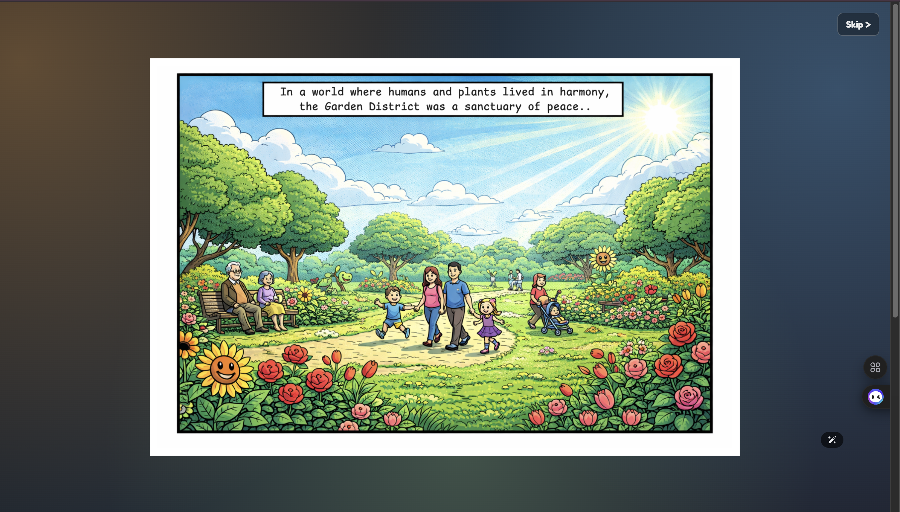
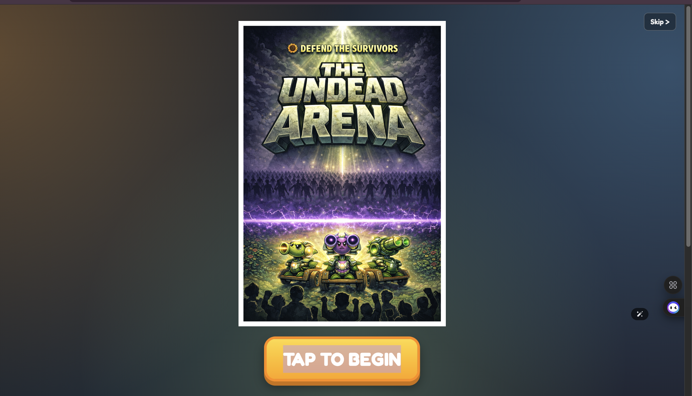
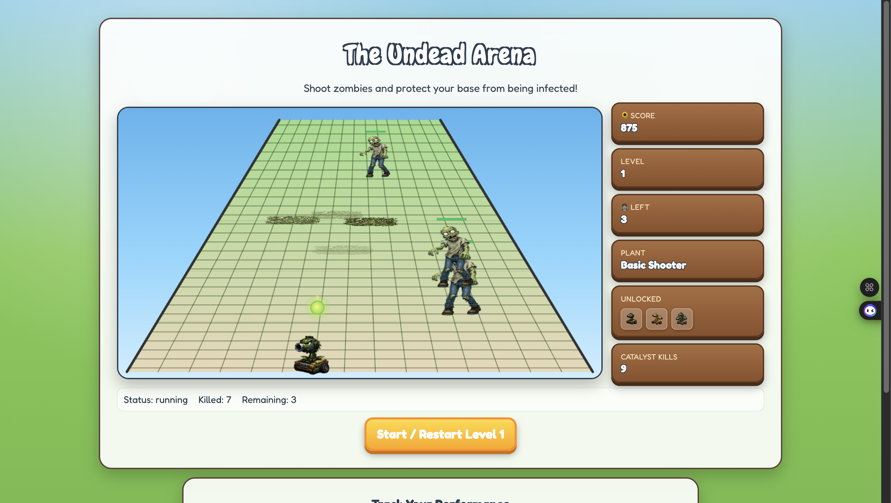
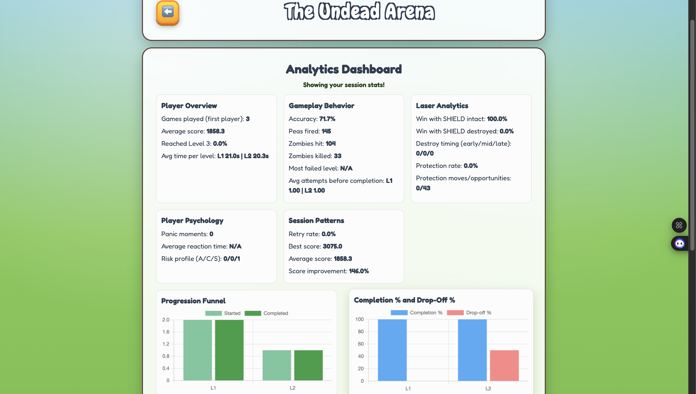
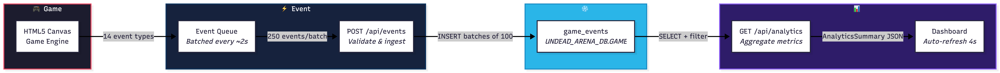
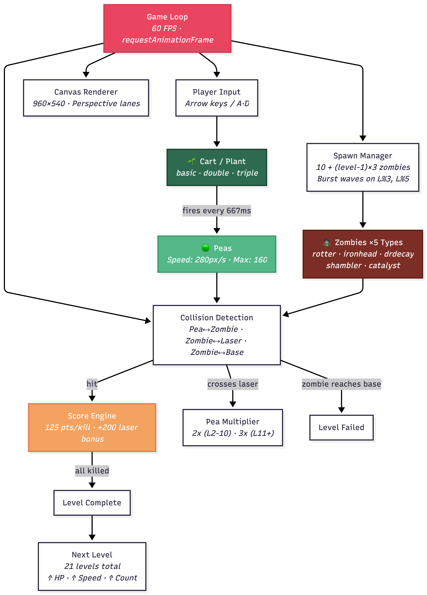
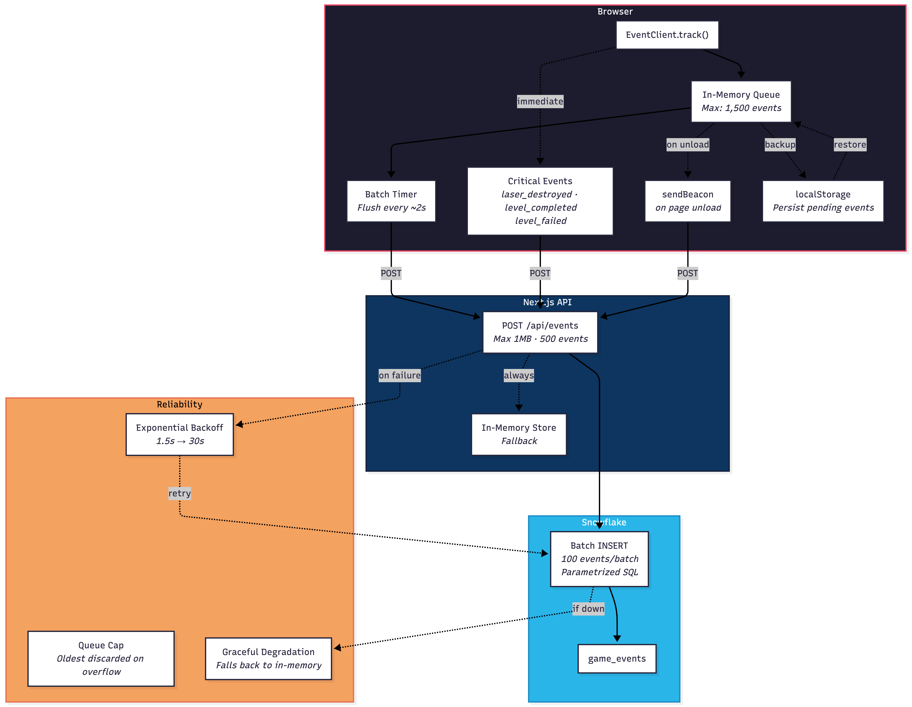

# The Undead Arena

**A lane-based zombie defense game with real-time Snowflake-powered analytics.**

Built for the **Snowflake Buildathon** — The Undead Arena combines a fully playable, canvas-rendered arcade game with a production-grade telemetry pipeline that streams every gameplay event into Snowflake for live analysis.

> Play the game. Unlock shooter plants. Kill the zombies. Watch the data flow.

---

## Game in Action

<table>
  <tr>
    <td></td>
    <td></td>
  </tr>
  <tr>
    <td></td>
    <td></td>
  </tr>
</table>

---

## Tech Stack

| Layer | Technology |
|-------|-----------|
| Frontend | Next.js 14 (App Router), React 18, TypeScript |
| Styling | Tailwind CSS |
| Game Engine | HTML5 Canvas |
| Visualization | Chart.js + react-chartjs-2 |
| API Layer | Next.js API Routes |
| Data Warehouse | **Snowflake** (`snowflake-sdk`) |

---

## Architecture

### System Overview

The full data path — from a zombie kill on the canvas to a chart on the dashboard.

  

1. The game loop emits structured events on every kill, level change, shield use, and game outcome.
2. Events are buffered client-side and batch-flushed every ~2 seconds (critical events flush immediately).
3. `/api/events` validates and writes event batches directly to Snowflake.
4. `/api/analytics/summary` queries Snowflake to compute real-time dashboard metrics.
5. `/dashboard` renders session-level and aggregate gameplay insights.

### Game Engine

What's running inside the canvas at 60 FPS — spawning, shooting, collision, and scoring.

  

- **5 zombie types** with distinct HP, speed, and behavior — rotter, ironhead, drdecay, shambler, catalyst
- **3 plant tiers** unlocked through gameplay — basic, double, triple shot
- **Laser shield** multiplies peas (2x/3x) and adds a tactical protection layer with cooldown on destruction
- **21 levels** with scaling difficulty, burst waves, and Fibonacci-level specials

### Event Pipeline and Reliability

How gameplay telemetry survives network failures and reaches Snowflake intact.

  

- **14 event types** tracked — from `pea_fired` to `panic_detected`
- **Batched delivery** — 250 events per POST, flushed every ~2 seconds
- **Critical event fast-path** — `laser_destroyed`, `level_completed`, `level_failed` flush immediately
- **Exponential backoff** (1.5s to 30s) on transient failures
- **localStorage persistence** + `sendBeacon` on page unload — no events lost
- **Graceful degradation** — if Snowflake is unreachable, analytics falls back to in-memory store

---

## Snowflake Integration

Every gameplay action is captured as a structured event and persisted to Snowflake in near real time.

| Snowflake Object | Value |
|---|---|
| Warehouse | `UNDEAD_ARENA_WH` |
| Database | `UNDEAD_ARENA_DB` |
| Schema | `GAME` |
| Table | `game_events` |

### Event Schema

| Column | Type | Purpose |
|--------|------|---------|
| `event_id` | STRING | Unique event identifier |
| `session_id` | STRING | Groups events by play session |
| `timestamp` | TIMESTAMP | When the event occurred |
| `event_type` | STRING | Category: `kill`, `level_start`, `game_over`, etc. |
| `level` | INTEGER | Current game level |
| `data` | VARIANT | Flexible JSON payload (zombie type, score, HP, etc.) |

---

## What Makes This Project Stand Out

**Most game projects stop at gameplay. We didn't.**

Every kill, every level, every game over is a data point — captured, batched, delivered, and queryable. The result is a game that's fun to play *and* a working demonstration of real-time event analytics on Snowflake.

- **End-to-end Snowflake integration** — not a mock, not a log dump. Structured writes and live reads.
- **Production-style event pipeline** — batching, retry, backoff, queue management, graceful degradation.
- **Playable-first design** — the game is genuinely engaging, not just a data demo.
- **Session-aware dashboard** — high-signal metrics computed directly from Snowflake queries.

